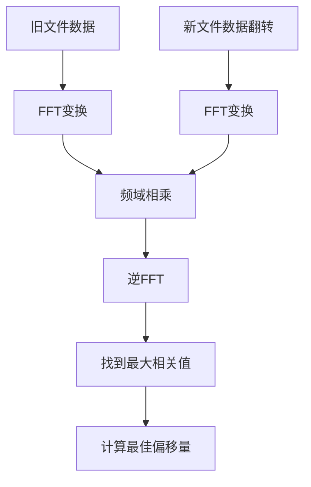

# BinDiff - 二进制差分压缩工具

BinDiff 是一个基于 FFT (快速傅里叶变换) 的高性能二进制差分压缩和补丁工具，使用 Go 语言开发。该工具能够高效地计算两个二进制文件之间的差异，生成紧凑的补丁文件，并支持补丁的应用。

## 🚀 项目特性

- **FFT 对齐优化**: 使用快速傅里叶变换算法计算最佳文件对齐偏移量
- **高效差分算法**: 基于哈希块的智能匹配算法，提供高压缩比
- **二进制补丁格式**: 自定义的 `.bdf` (Binary Diff Format) 文件格式
- **文件完整性验证**: 使用 SHA256 哈希值确保文件完整性
- **命令行友好**: 简洁易用的命令行接口
- **跨平台支持**: 支持 Windows、Linux、macOS

## 📋 目录结构

```
bindiff-master/
├── main.go           # 程序入口和命令行接口
├── cmd/              # 命令实现
│   ├── diff.go      # diff 命令实现
│   └── apply.go     # apply 命令实现
├── core/             # 核心算法实现
│   ├── diff.go      # 差分算法和补丁编解码
│   ├── align.go     # FFT 对齐算法
│   └── fft.go       # FFT 实现
├── pkg/              # 可复用包
│   ├── config/      # 配置管理
│   ├── logger/      # 日志系统
│   └── utils/       # 工具函数
├── test/             # 测试文件
│   ├── config/      # 配置模块测试
│   └── core/        # 核心模块测试
├── types/            # 类型定义
│   └── types.go     # 数据结构和常量定义
├── go.mod           # Go模块依赖
└── .gitignore       # Git忽略文件
```

## 🛠️ 安装和构建

### 前置要求

- Go 1.18 或更高版本
- Git (用于克隆代码)

### 从源码构建

```bash
# 克隆项目
git clone <repository-url>
cd bindiff-master

# 安装依赖
go mod tidy

# 构建项目
go build -o bdiff main.go

# 或者直接运行
go run main.go
```

### 安装依赖包

项目依赖以下外部包：
- `github.com/spf13/cobra` - 命令行接口框架

## 📖 使用说明

### 基本命令

BinDiff 提供两个主要命令：

#### 1. 生成差分补丁

```bash
bdiff diff <旧文件> <新文件> [-o <补丁文件>]
```

**示例：**
```bash
# 比较两个文件并生成补丁
bdiff diff old_version.bin new_version.bin -o update.bdf

# 不指定输出文件名时，默认生成 patch.bdf
bdiff diff old.exe new.exe
```

#### 2. 应用补丁

```bash
bdiff apply <原文件> <补丁文件> [-o <输出文件>]
```

**示例：**
```bash
# 应用补丁生成新文件
bdiff apply old_version.bin update.bdf -o patched_version.bin

# 不指定输出文件时，使用补丁中的文件名
bdiff apply old.exe update.bdf
```

### 命令选项

#### 全局选项

- `-r, --repo <目录>`: 指定仓库目录 (默认: `.binary_index`)

#### diff 命令选项

- `-o, --output <文件>`: 指定输出补丁文件名 (默认: `patch.bdf`)

#### apply 命令选项

- `-o, --output <文件>`: 指定输出文件名 (默认: 使用补丁元数据中的文件名)

## 🔧 工作原理

### 1. FFT 对齐算法

BinDiff 使用 FFT 算法计算两个文件的最佳对齐偏移量：



### 2. 差分算法

基于对齐结果，算法识别以下操作类型：
- **COPY**: 复制原文件中的数据段
- **INSERT**: 插入新数据
- **REPLACE**: 替换数据段
- **DELETE**: 删除数据段
- **MATCH**: 匹配相同的数据块

### 3. 补丁文件格式

`.bdf` 文件采用以下二进制格式：

```
+----------------------------------+
|         Magic Number (4字节)       | 0x42444646 ('BDFF')
+----------------------------------+
|        Version Number (4字节)      | 版本号
+----------------------------------+
|      Old File Name Length (4字节)  | 原文件名长度
+----------------------------------+
|         Old File Name             | 原文件名
+----------------------------------+
|      New File Name Length (4字节)  | 新文件名长度
+----------------------------------+
|         New File Name             | 新文件名
+----------------------------------+
|         Old File Size (4字节)      | 原文件大小
+----------------------------------+
|         New File Size (4字节)      | 新文件大小
+----------------------------------+
|         Old File SHA256 (32字节)   | 原文件哈希
+----------------------------------+
|         New File SHA256 (32字节)   | 新文件哈希
+----------------------------------+
|           Offset Value (4字节)     | 偏移量
+----------------------------------+
|        Diff Data Length (4字节)    | 差分数据长度
+----------------------------------+
|           Diff Data               | 差分数据
+----------------------------------+
```

## 💡 技术特性

### 核心算法

1. **FFT 对齐优化**: 通过 FFT 算法找到最佳文件对齐位置，提高差分效率
2. **哈希块匹配**: 使用 SHA256 哈希快速识别相同的数据块
3. **智能操作生成**: 自动选择最优的操作序列（复制、插入、替换等）

### 性能优化

- 块大小: 1024 字节 (可配置)
- 最小匹配长度: 64 字节
- 内存高效的流式处理
- 二进制格式减少存储开销

### 安全特性

- SHA256 文件完整性验证
- 魔数验证防止文件损坏
- 版本兼容性检查

## 🔍 示例场景

### 软件更新分发

```bash
# 为软件版本创建更新补丁
bdiff diff myapp_v1.0.exe myapp_v1.1.exe -o update_v1.0_to_v1.1.bdf

# 用户端应用更新
bdiff apply myapp_v1.0.exe update_v1.0_to_v1.1.bdf -o myapp_v1.1.exe
```

### 大文件同步

```bash
# 生成数据库备份的增量补丁
bdiff diff backup_old.sql backup_new.sql -o db_increment.bdf

# 在目标服务器应用增量更新
bdiff apply backup_old.sql db_increment.bdf -o backup_latest.sql
```

## 🐛 故障排除

### 常见错误

1. **"hash mismatch"**: 原文件已被修改，与补丁不匹配
2. **"invalid patch file"**: 补丁文件损坏或格式不正确
3. **"unsupported patch version"**: 补丁版本不兼容

### 调试技巧

- 使用 SHA256 工具验证文件完整性
- 检查文件权限和路径
- 确保有足够的磁盘空间

## 🤝 贡献指南

欢迎提交 Issue 和 Pull Request！

### 开发环境设置

```bash
# 克隆项目
git clone <repository-url>
cd bindiff-master

# 安装开发依赖
go mod download

# 运行测试
go test ./...

# 代码格式化
go fmt ./...
```

## 📄 许可证

本项目采用 [MIT 许可证](LICENSE)。

## 📧 联系方式

如有问题或建议，请通过以下方式联系：
- 提交 GitHub Issue
- 发送邮件至 [2737459675@qq.com]

---

**注意**: 请在使用前备份重要文件，虽然工具经过测试，但建议在生产环境中谨慎使用。